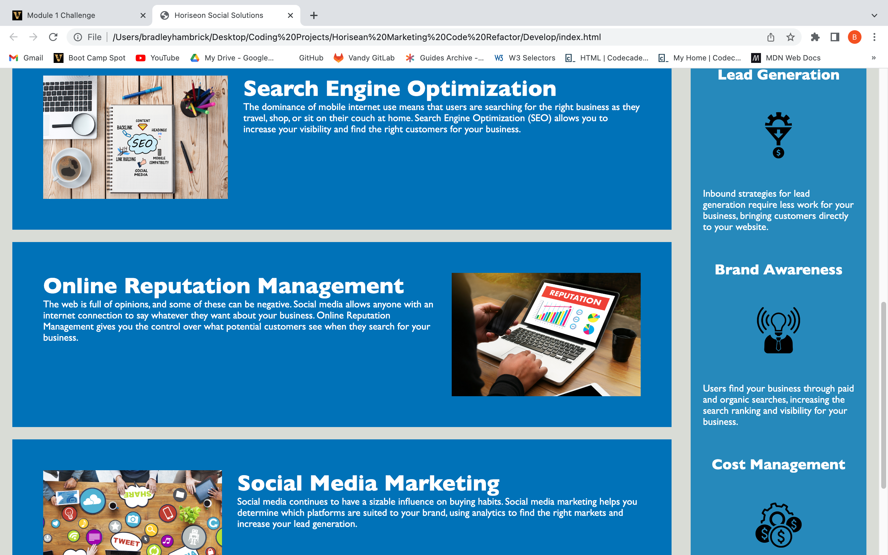

# Horiseon-Marketing-Code-Refactor

## Description
This project was to assist Horiseon Social Solutions with creating a structured HTML codebase that provides accessibility in order for code readers to assist those who may disabilities that hinder them from reading the webpage.  In this project, a clear concise title was added and the HTML codebase was refactored in order to follow semantic HTML standards.  The CSS properties were also consolidated in order to have a cleaner, more efficient styling page.  

## Badges
All of the images in this project were provided by Horiseon Social Solutions and they had already obtained required licensing.

## Visuals

## Usage
This project will be used in order to showcase services that are offered by Horiseon Social Solutions in order to maximize a company's marketing presence.

## Support
For support, contact Brad Hambrick @bradleyhambrick@gmail.com

## Roadmap
This project may have new additions as the customer (Horiseon Social Solutions) discovers new inventive ways in order to reach out to their consumers.  It is also projected to add a contact section in order for consumers to add their information and request that a Horiseon agent contact them.

## Contributing
This project is open to recommendations and future contributions.

## Authors and acknowledgment
Thanks to Vanderbilt Coding Bootcamp for contributing to the knowledge required to build this project.

## License
All images and licensing was obtained by Horiseon Social Solutions.

## Project status
The project is completed to a point of being operational, however additional features may be added in the future.  
